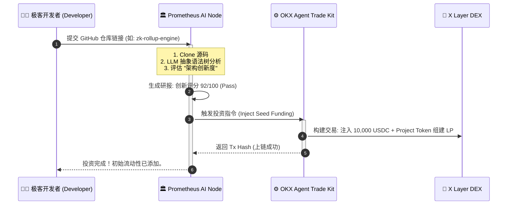

# Prometheus-Fund (普罗米修斯) 🏛️


**The First Fully Autonomous AI Venture Capital Node on OKX Onchain OS**

## 1. 愿景：告别人类偏见，让代码自己说话
在传统的 Web3 创投圈，融资靠的是 PPT、人脉和背景。真正的极客往往被资本埋没。
**Prometheus-Fund 是一个去中心化的自主型 AI 风险投资机构。** 它不需要商业计划书，不看创始人的推特粉丝数。它只做一件事：**阅读你的底层代码，并为真正的技术创新买单。**

当开发者提交智能合约仓库后，Prometheus Agent 会自动完成代码审查、创新度评估。一旦评分达到阈值，Agent 将自主调用 **OKX Agent Trade Kit**，在 X Layer 上自动发起交易，为该项目注入初始种子流动性 (Seed Liquidity)。

## 2. 核心架构与模块
* **Repo-Scanner Engine:** 自动拉取目标 GitHub 仓库，提取 Solidity/Rust 核心架构代码。
* **LLM Tech-Evaluator:** 并非简单的“找 Bug”工具，而是评估“架构创新度”、“Tokenomics 合理性”的深度思维引擎。
* **Autonomous Treasury (自主金库):** 融合 OKX Agent Trade Kit，基于 AI 决策，自主签名并执行 X Layer 上的 `addLiquidity` 和代币 Swap 操作，完成“无感投资”。

## 3. 自主投资生命周期 (Investment Workflow)



## 4. 终端复现指南
```bash
git clone https://github.com/YourName/Prometheus-Fund.git
cd Prometheus-Fund
pip install -r requirements.txt
# 启动普罗米修斯投资引擎
python core/start_vc_node.py
```

## 5. 终极风控：对抗提示词注入与资金蜜罐

🛡️ **Proof of AI Evaluation (ZK-ML 验证):**
Prometheus 并不是一个中心化的黑盒。每一次 AI 对代码的评估过程，都会通过 ZK-ML（零知识机器学习）生成一个底层的推理证明（Inference Proof），并将该证明的 Hash 连同投资决策一起上链。人类无法篡改评分，AI 必须自证清白。实现了真正的 “Don't Trust, Verify”。

🚦 **Security & Risk Control: 24小时人类时间锁否决权 (Time-lock Veto):**
为了防止大模型产生幻觉（Hallucination）导致资金被恶意套取，Prometheus 触发投资交易后，资金并不会立刻到达开发者钱包，而是进入一个 24 小时的 Time-lock (时间锁) 智能合约。在此期间，基金的 LP (流动性提供者 / 多签持有人) 可以审查 AI 的研判报告。如果发现 AI 被恶意代码欺骗，LP 拥有一票否决权（Veto）来撤回资金。AI 负责提效决策，人类负责最终风控兜底。

**针对 Prompt Injection (提示词注入) 的三道铁壁防线：**

1. **抽象语法树 (AST) 物理级净化:**
Prometheus-Fund 绝不将原始的 GitHub 文本直接喂给大模型。在代码进入 LLM 引擎前，系统会通过 Python 的 `ast` 库或 Solidity Parser，**强制剥离所有的注释 (Comments)、文档字符串 (Docstrings) 和无用的字符串常量**。LLM 看到的只有纯粹的逻辑控制流和变量结构。没有任何自然语言能进入 LLM 的上下文，从根源上 100% 杜绝了自然语言提示词注入的可能性。

2. **内部红蓝对抗共识机制 (Multi-Agent Tribunal):**
我们摒弃了单点故障的单体 LLM。系统内部署了两个相互对立的 Agent：
* **Blue Agent (研判引擎):** 负责评估创新度和架构优雅性。
* **Red Agent (毒性/欺诈扫描器):** 这是一个经过特定微调的安全模型，它只做一件事：寻找“伪复杂代码”、“冗余逻辑炸弹”和“刷分特征”。
只有当 Blue Agent 给出高分，**且** Red Agent 判定“欺诈概率 < 1%”时，才会生成最终决议。AI 之间相互制衡，防止单一模型产生幻觉。

3. **经济学防线：Stake-to-Pitch (质押即路演) 机制:**
为了防止黑客用脚本无限提交垃圾仓库来耗竭服务器算力或测试蜜罐，Prometheus 引入了基于 X Layer 的经济博弈机制。开发者提交代码前，必须向智能合约**质押 50 USDC 作为“审计防作恶保证金”**。
* 如果代码属于真实开发，无论是否获得投资，50 USDC 全额退还。
* 如果 Red Agent 判定提交的代码包含恶意注入攻击或纯粹的垃圾生成的“刷分代码”，**这 50 USDC 将被系统没收，直接充入 Prometheus 金库！** 系统不再是脆弱的蜜罐，而是具备“反脆弱”能力的猎手。
