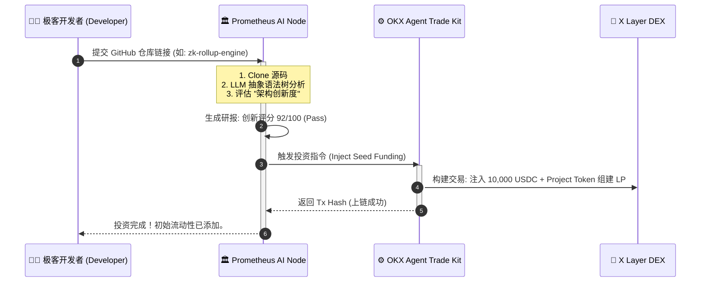

# Prometheus-Fund (普罗米修斯) 🏛️
**The First Fully Autonomous AI Venture Capital Node on OKX Onchain OS**

## 1. 愿景：告别人类偏见，让代码自己说话
在传统的 Web3 创投圈，融资靠的是 PPT、人脉和背景。真正的极客往往被资本埋没。
**Prometheus-Fund 是一个去中心化的自主型 AI 风险投资机构。** 它不需要商业计划书，不看创始人的推特粉丝数。它只做一件事：**阅读你的底层代码，并为真正的技术创新买单。**

当开发者提交智能合约仓库后，Prometheus Agent 会自动完成代码审查、创新度评估。一旦评分达到阈值，Agent 将自主调用 **OKX Agent Trade Kit**，在 X Layer 上自动发起交易，为该项目注入初始种子流动性 (Seed Liquidity)。

## 2. 核心架构与模块
* **Repo-Scanner Engine:** 自动拉取目标 GitHub 仓库，提取 Solidity/Rust 核心架构代码。
* **LLM Tech-Evaluator:** 并非简单的“找 Bug”工具，而是评估“架构创新度”、“Tokenomics 合理性”的深度思维引擎。
* **Autonomous Treasury (自主金库):** 融合 OKX Agent Trade Kit，基于 AI 决策，自主签名并执行 X Layer 上的 `addLiquidity` 和代币 Swap 操作，完成“无感投资”。

## 3. 自主投资生命周期 (Investment Workflow)



## 4. 终端复现指南
```bash
git clone [https://github.com/YourName/Prometheus-Fund.git](https://github.com/YourName/Prometheus-Fund.git)
cd Prometheus-Fund
pip install -r requirements.txt
# 启动普罗米修斯投资引擎
python core/start_vc_node.py
```
